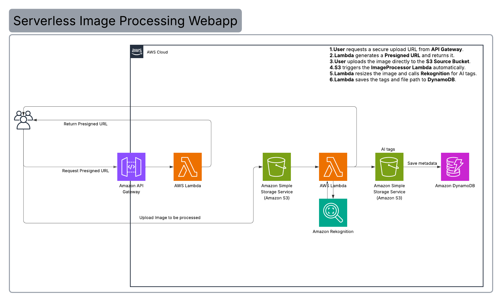

# AI-Driven Serverless Image Processing Pipeline
**Developer:** Abdullah Ahmed  
**Region:** `eu-central-1` (Frankfurt)  

---

## 1. Solution Architecture
The architecture follows a fully decoupled, serverless pattern to handle image uploads, automated resizing, and AI-driven metadata extraction.

### Architectural Workflow:
1.  **Handshake:** The Client (Browser) requests a secure upload URL from **Amazon API Gateway**.
2.  **Authorization:** A **Lambda function** (`GetPresignedUrl`) generates an S3 Presigned URL, allowing the client to upload safely without AWS credentials.
3.  **Ingestion:** The Client uploads the raw image directly to the **Source S3 Bucket**.
4.  **Trigger:** S3 detects the new object and triggers the **ImageProcessor Lambda** via an Event Notification.
5.  **Intelligence & Optimization:** The Lambda dynamically installs the **Pillow** library in `/tmp`, resizes the image, and calls **Amazon Rekognition** to identify objects and labels. This specific "Bootstrap" method was implemented to overcome library dependency and cold-start issues encountered during development.
6.  **Persistence:** All metadata (Labels, S3 paths, and Timestamps) is stored in **Amazon DynamoDB**, and the processed image is saved to the **Destination S3 Bucket**.

---

## 2. Technical Stack
| Service | Role |
| :--- | :--- |
| **Frontend** | HTML5, CSS3, JavaScript (Vanilla) |
| **API Layer** | Amazon API Gateway (HTTP API) |
| **Compute** | AWS Lambda (Python 3.12) |
| **Storage** | Amazon S3 (Standard Storage Class) |
| **AI / ML** | Amazon Rekognition |
| **Database** | Amazon DynamoDB (NoSQL) |

---

## 3. Deployment & Configuration
### Prerequisites
* **IAM Role:** A single execution role (`ImageProcessorRole-Frankfurt`) with the following managed policies:
    * `AmazonS3FullAccess`
    * `AmazonRekognitionFullAccess`
    * `AmazonDynamoDBFullAccess`
    * `CloudWatchLogsFullAccess`

### Key Settings
* **Lambda Timeout:** The `ImageProcessor` function is configured with a **1-minute timeout** to account for the runtime installation of the `Pillow` library.
* **S3 CORS:** The source bucket is configured with a CORS policy to allow `PUT` and `POST` methods from the frontend origin.
* **Signature Version:** The Boto3 clients are forced to use `s3v4` to comply with the strict security requirements of the Frankfurt region.

---

## 4. Challenges Overcome
1.  **CORS & Signature Mismatch:** Resolved 403 Forbidden errors by aligning S3 Signature Version 4 with the frontend Fetch API and removing conflicting headers.
2.  **Cold Start Dependencies:** Optimized the Lambda runtime to dynamically install image processing libraries within the ephemeral `/tmp` storage, ensuring the deployment package remains lightweight.
3.  **Regional Constraints:** Successfully migrated and synchronized all services within the `eu-central-1` region to minimize latency and ensure endpoint compatibility across S3 and API Gateway.

---

## 5. Live Demonstration (Optional)
* **Demo Video:** [[Link to Video](https://drive.google.com/drive/folders/1SQqFGP3nZBZYtsE2ewIAYhBhss9h8vJC?usp=sharing)]
